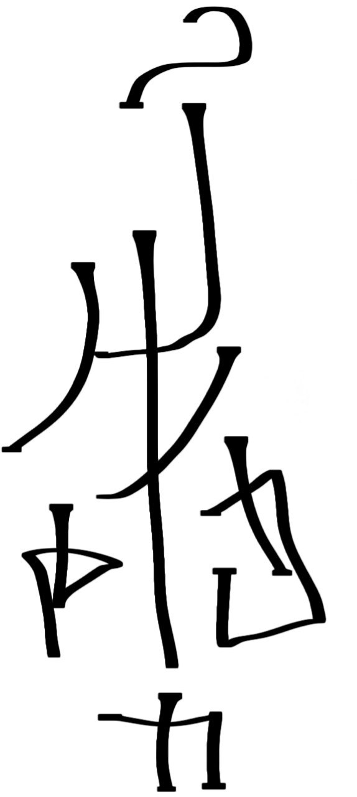
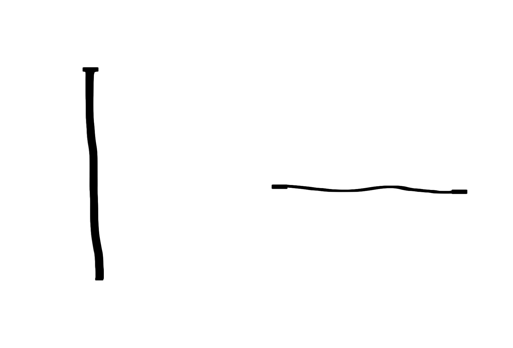
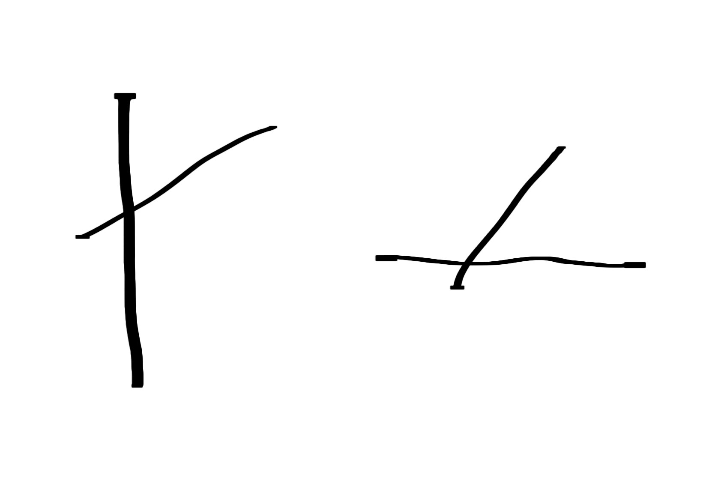
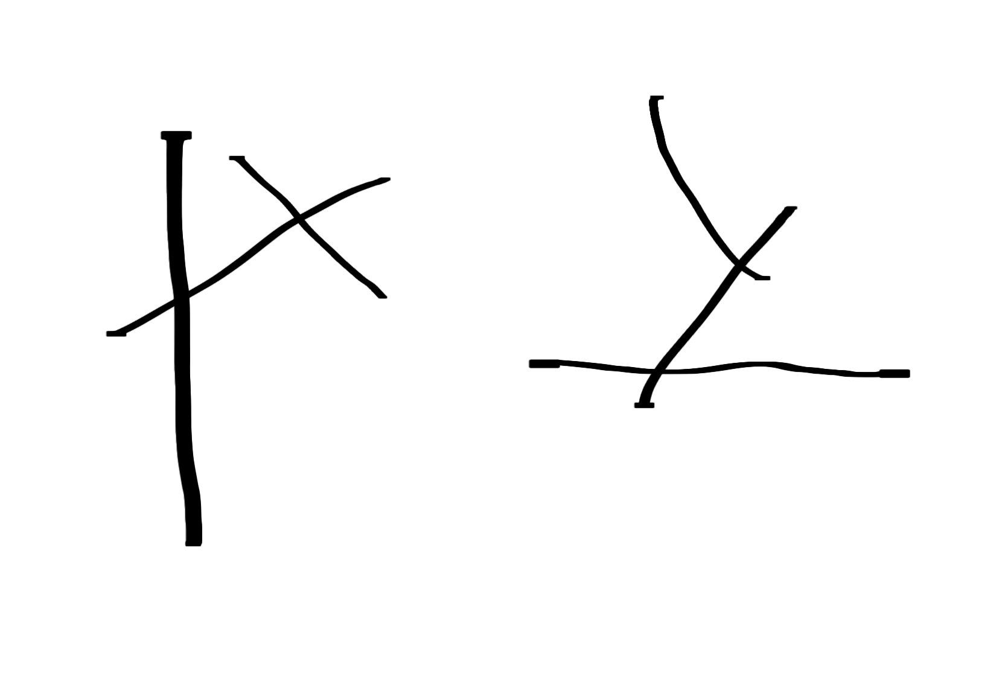
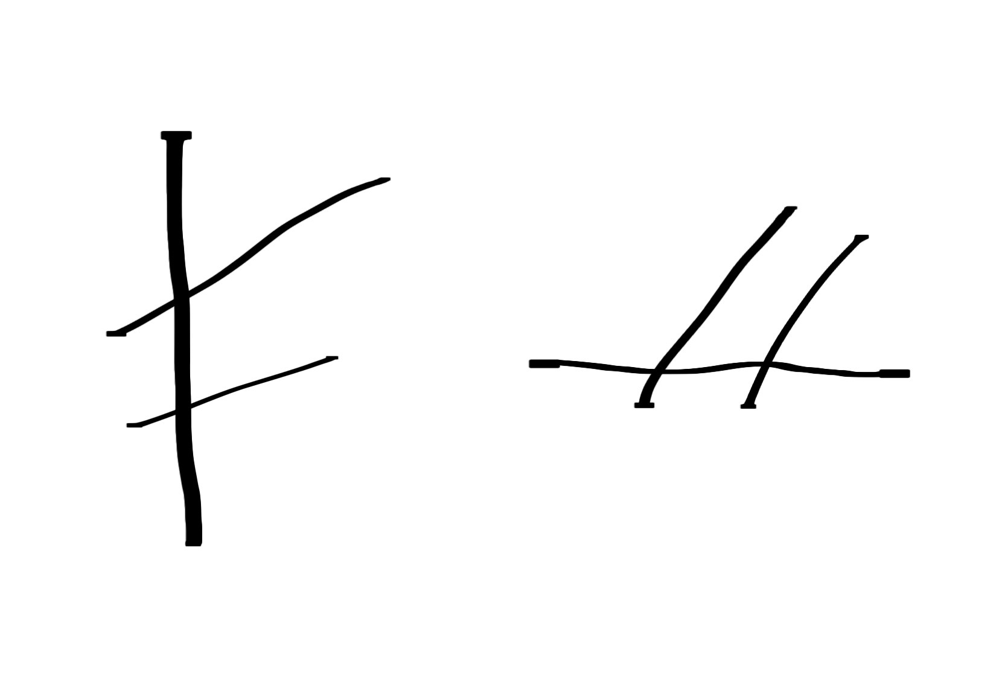

**Настоящий документ предстваляет собой попытку структурированния различных заметок конланга, разработанного мной для описания снов**

`А зачем вообще?`

  Нужду в таком конланге я осознал когда понял, что для описания многих вещей из моих снов в естественном языке приходится прибегать либо к сложным синтаксическим конструкциям, либо невозможно вовсе. 
У меня имеется опыт в создании конлангов и по этому создать ещё один специально для этого у меня, вероятно не составит проблем.

Стоит учесть что я никогда не обучался ни на лингвиста, ни на филолога, потому не могу в полной мере обладать профессиональной терминологией и могу совершать ошибки.

  При создании языка я вдохновлялся компактной и продуманной структурой ифкуиля, но хотел отдалится от его непроизносимой фонетики и ненужной для моих целей сложности. 
Тогда как ифкуилю нужно максимально объемно и точно описывать всю реальность, моему конлангу нужна только сновидческая. Так же источниками вдохновения стали: закон чередования гласных японского языка, система трёхбуквенных корней семитских языков и предикатная грамматика ложбана

`Чего у нас нету?`

  Конланг только в разработке, и не имеет даже названия, 
но в этом документе будет использовано рабочее название Сомноглифс или LyXyKy по обозначеням трёх его частей речи. 
Однако, то, что я перечислю далее уже позволяет записывать отрывки из сновидений, и то, что предстоит ещё продумать, будет написано под описанием вещи, которая уже есть в конланге. 
В будущем не исключаю полную переработку всей системы.

`Что у нас есть?`

  Итак. Прежде чем описывать морфологию и грамматику следует рассказать о фонетике и систем письменности. 

## Фонетика и Орфография.

В LyXyKy имеется 2 системы письма:

1. Латиница с добавлением диакритики.
2. Моё собственное фоноидеографическое письмо с элементами абугиды.

пример фоноидеографического письма на макете языка

  Сначала в документе будет рассматриваться только латиница, в то время как фоноидеграфическое письмо будет рассмотрено в самом конце.

Гласные: y e a o u i
Согласные: q w r ŗ t p s š d f g h k ĺ l ļ z x b n m v ł þ

(скорее всего половина набора согласных в будущем пойдёт под нож)

**Большинство букв читаются интуитивно но для некоторый нужно пояснение**

y – это звук известный как гласный среднего ряда среднего подъёма или же звук шва (от ивр. שְׁוָא [ʃˈva] — ничто), обозначаемый в МФА символом "ə".

q – обозначает звук /kʷ/ – губно‑смягчённый вариант k.

ŗ – читается [ɹ] – «альвеолярный приближённый согласный». Как в английском слове red

š – ш

ĺ – Ль (тогда как l ближе к русскому "л")

ł – губно-смягчённый вариант L

ļ – глухой боковой фрикатив /ɬ/. Читается как в валлийском слове llan

x – не "икс" а звук близкий к русскому звуку "х"

þ – Глухой зубной щелевой согласный. как в английском слове thin

В языке действует закон чередования согласный-гласный и нарушает его только второй согласный трёхбуквенного корня, который никогда не t p d g b ĺ. 
Планируется добавление формализированного ударения или ударного тона, системы мор, и/или просто тонов, которые могут быть встроенны в морфологию.

## Морфлогия.

  Теперь мы подошли к основной и самой большой части языка. Сомноглифс имеет 3 части речи

1. Аксы – служат для описания субъектов и объектов сна  
2. Акты – служат для описания событий, абстрактных действий или действий между субъектами
3. Контексты – служат для описания сцены, пространства. Без него акты и аксы зависают в вакууме. Отсутсвием контекста можно описать абстрактное сновидческое переживание, вне пространства.

Важное замечание: Аксы и Акты не являются тем же самым, что существительные и прилагательные. В будущих примерах это станет видно

  **Аксы**

  Обозначается маркером L перед трёхбуквенным корнем. Лучше всего его работу можно продемонстрировать на примере. Допустим, у нас есть трёхбуквенный корень обозначающий "чёрный", пусть это будет BND
(все корни условные, и вероятно большая их часть не войдёт в итоговый словарь трёхбуквенных корней). Из этого корня можно образовать акс, акт и контекст. сейчас нас интересует акс, поэтому перед корнем нужно поставить L.
Вот так это будет выглядить:

*LyByndy* – в полной мере можно перевести как "Эта сущность, не вызывающая у меня эмоций подобно/имеет связь с чёрным"
Данное слово содержит минимальный набор необходимых морфологических категорий для слова. Чтобы их увидеть разберём само слово:

L – Маркер акса.

y (после L) – нейтральный эмоциональный маркер (о них будет раздел ниже)

Byndy – слово "чёрный" в первой породе т.е. "быть подобным чёрному/иметь связь с чёрным" (о породах так же будет раздел ниже)

Таким тобразом, обязательными категориями являются: маркер части речи, эмоц.маркер, Трёхбукв.корень+порода в строгом, соответственном порядке

  Необязательными морфологическими категориями является то, что я называю конфигурационный набор. Это три буквы перед маркером части речи: согласный-гласный, согласный, гласный. каждая фонемо обохначает соответственно:

  **количество:**

[ничего] - базовая аналог ед числа
hy ha he hi ho hu wy wa we wo – 0 1 2 3 4 5 6 7 8 9.
Не точные показатели "много/мало" выражаются через маркеры силы (о них будет раздел ниже)

**конфигурация**

[ничего] – связь отсуствует
r – сплоченность, такая, где каждый дополняет друг-друга. например команда
ŗ – ряд
Ł – цепочка, типо ряд но связаны между собой, например схожестью или на прямую
w – каждый компонент связи является частью чего-то большего, например как виноградинки являются частью виноградной лозы

  **отношение**

y – нейтральное

o – агресивное

a – радостное

u – страх

i – печальное

(коротко говоря такое же, как и эмоц. маркеры)

  Разница между эмоц.маркером и отношением: эмоциональный маркер показывает как я отношусь к сущности, а отношение как сущность относится ко мне.
Расстановка такая: [кол.][конф.][отношен.эмоц.][часть.речи][эмоц.маркер][корень+порода]
пример слова:

*hełylyKawta* – "два кота имеющие связь между собой, и относящиеся ко мне нейтрально, вызывают у меня нейтральные чувства"

Очень сырая система. Пока не известно насколько конфигурационный набор применим к остальным частям речи, да и в принципе, как детально работает внутри аксов

  **Акты**

  Акты выражаются согласной X перед трёхбуквенным корнем, ровно так же как со словами-сущностями. Минимальные необходимые морфологические категории такие же, как и в аксах.
В будущем планируется добавить нормальное вырожение разных времён.

Примеры слов и предложений:

*XoByNMy* – "событие или действие, вызывающее у меня боль или агрессию, подобно чёрному"

*hełylyKaWTa Xo* – "два кота, имеющие связь между собой и относящиеся ко мне нейтрально, вызывают у меня нейтральные чувства сами по себе, но действуют в отношении ко мне так, что это вызывает у меня боль."

  **Контекст**

  Описывает пространство, сцену и их характеристики. Выражается через маркер K.

В будущем планируется добавить выражение плоскости (трёхмерное, двумерное)

P.s. прототип системы для выражения плоскости уже имеется

Примеры слов:

KoByNMy – некое пространство, имеющее связь с чёрным цветом

  **Эмоциональный Маркер**

  Эмоциональный маркер представляет собой гласную фонему после маркера части речи. В зависимости от того какая эта гласная, такая и эмоция, которую я испытываю от акса, акта или контекста:

y – нейтральная эмоция т.е. отсутвие каких либо эмоций

o – агресия

a – радость

u – страх

i – печаль

представленные значения очень огрубленны. На самом деле условный маркер i обозначает весь спектр эмоций от лёгкой меланхолии до невероятной грусти. Уточнение значений происходит через маркеры силы, которые меняют реализацию гласной. Проблема только в том что я эту систему не доделал и она в полной мере не реализована. Так же к каждому эмоциональному маркеру приписывается характерный цвет. Это позволит создавать различное искуство на основе фоноидеографической письменности.

  **Породы**

  Система пород в моём конланге схожа с системой пород в семитских языках, кроме того, что в LyXyKy породы не обязательно глагольные. Ниже приведён список пород и примеры:

1. Порода "Подобная". CyCyCy. *LyWylwy*– сущность имеющая отношение к желтому, как-то с ним связана.

2.  Порода "Соотвествующая". CaCaCa. *LyWalwa* – сущность соотвествующая жёлтому из реальношо мира, жёлтая сущность, жёлтый

  У этих двух пород на данный момент есть "режим", отс помощью которого образуются ещё 2 породы:

1.  Порода "Схожая Искажённая". CuCoCy. *LyWolwy* – сущность как-то связана с искажённым жёлтым
2.  Порода "Соотвествующая Искажённая". CuCoCa. LyWolwa – сущность соотвествует искажённому жёлтому, жёлтая искажённая сущность.

Под искажённостью понимается английское слово cursed. Т.е. это не просто "измнённая версия существа", но его "проклятая" или "уродливая" версия.
Планируется в будущем добавление новых пород а так же адаптация имеющихся для будущих двухбуквенных и составных корней (скорее всего они будут четырёхбуквенные).

*Свойства**

  Из названия понятно, что это свойства тех или иных частей речи. Обычно они выражаются после корня или если его нету, то после маркера части речи при помощи фонемы ļ. Ļ может писаться без y если свойство не вызывает никаких чувств. Если свойство вложено в свойство, то вложенное свойство обозначается гортанной смычкой " ' " после основного свойства. В примеры приведу простейшие слова без корней: 

*Lyļyļy* – некая сущность, которая имеет некие 2 свойства. 
*Lyļy'y* – некая сущность, имеющая свойство которое имеет свойство

  **Дихотомия видится/воспринимается**

Иногда во снах бывает так, что предмет выглядит одним, но воспринимается и называется совершенно по другому. Например, условный сом (SWM), может восприниматься, называться как карась (KRS) и действия в отношении его идут как к карасю. Для таких случаев есть мофрологическая единица, способная показывать, что корень перед ней – то как видится, а после – как воспринимается.

 Это единица – š

*LaSawmašaKarsa* – сущность вызывающая у меня радостные эмоции, которая выглядит как сом, но воспринимается мною и окружающими как карась.

Или

XoSowmyšyKorsa – сомоподобное проклятое действие, или действие, характерное для уродливого сома, но воспринимаемое как действие проклятого/искаженного карася.

На этих примерах можно заметить, что гласный после š – поменялся. Это связано с законом гармонии гласной, когда гласный после этой морфологической единицы соответствует последнему гласному перед ним.

## Синтаксис

  В LyXyKy синтаксис представлен не в классических связках через предлоги и падежи, а через матрицу корня, в которой уже заложены все аргументы. Таким образом, допустим корень KLM обозначает "всё что связано с передвижением из пункта А в пункт Б", но конкретно в предложении это будет иметь значение "x1 передвигается в направлении х2, через/как х3, при помощи/в пространстве х4".

Пример:

  *Ĺy Xakalma La Ky* – я выполняю движение, вызывающее у меня радостные эмоции, к некой сущности, которая вызывает у меня радостные чувства, в неком пространстве, которое не вызывает у меня эмоций.

Поменять места аргументов можно при помощи þa þe þi þo (по местам аргументов соответственно):

  *þe La Xakalma þa Ĺy Ky* – обозначает тоже самое, что и выше.

Стоит так же сказать, что если x1 пропущен, то всегда подразумевается Ĺª, тогда

  *Xakalma La Ky* – тоже самое что и *Ĺy Xakalma La Ky*.

## Фоноидеографическое письмо

  До этого мы рассматривали только латиницу моего конланга. В этом разделее будут описаны базовые глифы и правила чтения фоноидеографического письма.

Самой основой любого слова записанного фоноидеографическим письмом является маркер части речи, который записывается длинной вертикальной чертой для L, и горизонтальной для X

  Свойство сущностей образуются пересекающимися линиями, особно не важно их направление.

  Сейчас мы написали то, что в латинице бы передавалось как lyļy и xyļy

  А это уже вложенные свойства, передаваемые латиницей как lyļy'y и xyļy'y

  Для наглядности посмотрим как выглядят 2 отдельных, не вложенных свойства:

